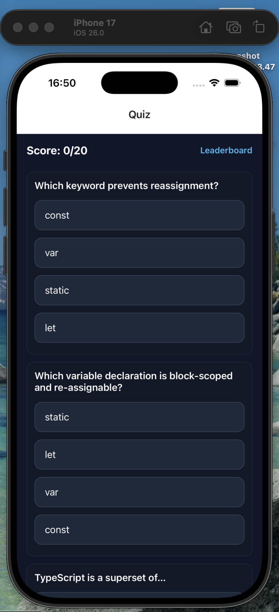

Implement application by using React-native with Typescript with following requirement below.

- Display 20 questions each question has 4 answer
- Every application re-load or re-open will be random question and answer
- Display to Leader board
- publish on git repository

